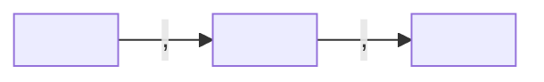

# Check the desk

The desk stays readable because its pages follow one model. This skill reads the model the
desk holds in `celorus/model/`, walks the pages, lists every gap in
`celorus/views/needs-attention.md`, and rebuilds the other views. It lists; it never blocks,
never refuses another skill's write, and never changes a page except the page's generated part.

One thing it does not do: if the model cannot be read, list the page and stop. Do not rebuild
a view or write a path page. It cannot be read when `celorus/model/model.md` is not there,
when its header does not parse, and also when the header parses perfectly and one of the
blocks the rest of the model is built from is missing; the same goes for a `kind-` page that
has lost its `kind`, `folder` or `must_have`. A header that reads cleanly is not the same as a
model that can be read, and a page that is one line short is the likeliest of the three. Every
view and every path page is written from the model, so they would otherwise be written from
words nobody wrote, and a wrong view is worse than yesterday's view. Say which page, and that
the views were left as they are.

Whether the desk's files are all there is a different question: "check my desk setup" is
`install-desk`'s verify mode. This skill reads what the pages say.

## Find the desk

The desk folder is the one named by `CELORUS_DESK`, or else the first folder found by walking
up from the working directory that contains `celorus/index.md`; the seat is `CELORUS_SEAT` or
the handle in `~/.celorus/seat-<desk_id>`, where `desk_id` is in `celorus/desk.md`. Without a
desk, say so in one line and offer `install-desk`. Without `celorus/desk.md` the desk is on
layout 1: say in one line that "update my desk" moves it to layout 2, and stop.

## How much to check

- After another skill writes: the pages it wrote, and the pages those pages link to.
- On "check my desk", and when `day-open` opens the day: every page.

## What you read

- `celorus/desk.md`: `pack`, and the switch `named_only_contact_details`.
- `celorus/model/model.md`: the kinds, the system types, the details every page carries, the
  account details, and `field_lists` (which detail takes its words from which list).
- Each `celorus/model/kind-<kind>.md`: its folder, its must-have and usual details, its pack
  if any.
- `celorus/model/connections.md`: `draws`, the connections that draw a line between two pages;
  `proof_required`, the connections that need a proof line; and `connections`, one entry per
  connection naming the kinds at its ends, `<connection>: <kind> -> <kind>, ...`. Read all
  three from the desk's own copy, never from anywhere else, and read them from that page's
  **header**: the page repeats the same entries as a list further down for whoever is reading
  it, and the header is the one the desk runs on. Where the two disagree the header wins and
  `check-desk` lists the page under layout, because a model page saying two things is the page
  to fix, not a choice to make.
- Each `celorus/model/list-<name>.md`: the words; for `stage`, `spine_steps`.
- `celorus/model/own-words.md`: the desk's own words, `<list>: <word> -> <pack word>` for a
  pack list and `<list>: <word>` for a desk-only list.
- Every other page under `celorus/`, except `model/`, `views/` and `merges/`.

A proof line sits under a page's `## Connections` heading:
`- <connection> [[<target>]] · <shown | said> · <register> · <date> · ...`, or for a guess
`- <connection> <target in plain words> · guessed · <register> · <date> · <why>`.

A proof line is a Markdown list item, so its bullet is a dash and one plain space. A dash
followed by any other blank is not a list item, and a line that is indented is a worked example
rather than a proof line - `check-desk` turns both away and says so, rather than passing over
them in silence. After the bullet the line is the person's own text, and a blank in the
person's text is any blank at all: a word processor and a phone keyboard produce no-break, en,
hair and ideographic spaces without being asked, Markdown renders them all as one space, and a
rule the person cannot see is not a rule they can follow. So when you READ a desk: the
connection word, then one or more blanks, then the target; and around each middle dot, accept
whatever blanks sit around the dot, including none. A dot inside `[[...]]` is part of a file
name and never a separator. When you WRITE one, write the dash with one plain space after it
and each separator as a middle dot with one plain space either side.

Read the heading the way Markdown reads it. Up to three plain spaces may stand before the
`##`, and four make it a code block; after the `##` there is one or more plain spaces or tabs,
because `##` followed by any other blank is not a heading at all and the person sees that line
unstyled; then the heading's text, then optionally blanks and a closing run of hashes. The text
is what is left once every blank at either end is gone, whatever kind of blank it is, and it is
`Connections` exactly, case and all. The section runs to the next heading of level one or two;
a `###` inside it stays inside. So `## Connections ` with a trailing space, `##  Connections`
and `## Connections ##` are all the section, because a person cannot tell them from it - and
`### Connections`, `## connections` and `## Connections and proof` are each a different
heading, because a person can see that they are.

A page of a kind that draws a line and has no such heading is listed (C14), and until the
heading is there, a question the desk finds no path for is answered with the hedge rather than
with "nothing connects". A page with a second `## Connections` heading is listed under layout
the same way: the first section is the one read, and the lines under the second are walked by
nobody. A desk whose own `model/connections.md` is listed under layout cannot say that nothing
connects either: while that page says two things, what draws a line on the desk is not
settled. Three of the reasons a page hedges are listed here too, so that the
check you are sent to can show them: on a page that states a kind, whose header reads, and whose
name is neither `index.md` nor `log.md`, a line under Connections you could not read is listed
under layout with the line, and so is a shown or said line whose target is not a link; a
connection word no copy of the model names is a word on no list. On any other page those same
two are C15 with the line, on the line's own page, because no layout row carries them there. A
page that did not decode at all is listed for that, and its lines are not read one by one. The rest are C15 that way too: a line the walk
could not take for a reason written on the desk itself. So a page that hedges sends you to a
check with a row behind the hedge, and every line the hedge names is on a row of it, unless a
page under `model/` is listed under layout. The desk's connections page unsettles every line at
once. A kind page that cannot be read takes its kind out of the model, and a line with that
kind at either end is then turned away with nothing on its own page to say why, because the row
that would say why is one of the model's own, and those stand down while a model page is
unreadable. Put that page's header back and the rows return.

## The rules

Each finding is one row: the words in bold, the page, and one line of detail.

1. **C01 unknown kind.** A page's `type` is neither a kind with a `kind-<kind>.md` page nor a
   system type in `model.md`. Or the kind belongs to a pack and the desk runs a different
   pack. A desk with no pack keeps every kind.
2. **C02 missing must-have detail.** `type` or `title` is empty; a must-have detail of the
   page's kind is empty; a person, family or firm holds one or two of `stage`,
   `relationship_kind`, `owner` but not all three. Not `index.md`, which by rule holds only its
   version, so C02 would otherwise report it twice over (no `type` and no `title`) against a
   file `install-desk` had just written correctly. `log.md` is not read here either, and it
   never could have been: by rule it has no header at all, so it is a page with no header
   before it is a page with a detail missing, and it falls to C12. Both are C12's to read.
3. **C03 word on no list.** A detail named in `field_lists` holds a word that is on neither
   its list nor the desk's own words for that list. A list with no words is not checked.
4. **C04 own word with no match.** An own-words entry for a pack list names no word on that
   pack list, or the entry cannot be read in either shape, or the desk's own word is now also
   a standard word on that list. In the last case the desk's meaning is kept; say which two
   meanings clash and let the person decide.
5. **C05 link that points at nothing.** A `[[link]]` names no page on the desk; a sent page's
   `file` is not in the desk folder.
6. **C06 connection with no proof line.** A header connection named in `proof_required` has no
   line under `## Connections` for the same connection and target.
7. **C07 guess drawn as a line.** A guessed line links its target; or a header connection whose
   only proof lines are guesses.
8. **C08 contact details on a named-only person.** While `named_only_contact_details` is
   `false`, a person whose `standing` is `named-only` carries an email address, a phone number
   or a `## Coordinates` section holding any line but `- Not established.` Drawing a fence
   round an address does not hide it: the marker lines are skipped and the words between them
   are read. If a fenced block on that page was never closed its structure cannot be read at
   all, so this rule reads the page the plain way and the row says so - it would rather list a
   worked example than go quiet about a person's address. The check lists; it never blocks.
9. **C09 name with no source.** A person's `name_source`, when it has one (a missing one is
   C02), is a link, where it should be the
   plain file name of the page the name came from; or it names no conversation, sent item,
   brief or research page on the desk, and is not `supplied-<list>`, `book` or
   `crm-export-<date>`.
10. **C10 may be the same.** Two persons, two firms or two families share a title or alias
    (the same words in any order), and neither lists the other in `not_same_as` (one file
    name, or a list of them).
11. **C11 file name used twice.** Two pages of a kind share a file name in different folders.
12. **C12 layout.** A required desk file is missing; a model page cannot be read; a fenced
    block on a page was opened and never closed, so the lines below it were not read, and the
    two rules that would have to assume something about them say nothing about that page until
    you close it: whether each connection in your header is backed by a proof line, and whether
    a link in the body points at a page. Links in the header are still checked;
    a page of a kind sits outside its kind's folder; a page has a second `## Connections`
    heading, and only the first is read; a header holds a nested value (only
    `sources` may);
    `index.md` holds anything but `okf_version: "0.2"`; `log.md` has a header, or a line that
    is not blank, `# Log`, a `## <date>` heading or a `* <time> · ...` line; `desk.md` is not on
    layout 2; `connections.md` names no `draws`, which would leave the rules about drawn lines
    passing in silence, or a word in `draws` has no entry under `connections:` naming the kinds
    at its ends, or such an entry names at an end something that is no kind of page on this
    desk: the rule about leaving a firm reads those ends. Two more rows on that same page: no
    kind is named `firm`, so the rule about leaving one is written against a word this desk
    does not use; and a connection is written twice, in the header and in the list under the
    text, and the two disagree, or one copy names it and the other does not; and a connection
    some copy says draws a line is not in `draws`, which is the quiet direction of that same
    drift, because `draws` is the copy the walk reads and a word dropped from it stops drawing
    over the whole desk while every other copy still says it does. One row on `model/model.md`,
    which is where both lists live: a word is named there both as a kind of page and as part of
    the desk itself, which quietly stops that kind being walked. While any page under `model/`
    cannot be read, whatever the reason, the rules that read from a model page of their own say
    nothing on this desk: C01, C03, the C04 row about a word of your own pointing at something
    no list holds, the C09 row about a name source naming no page of a kind that can hold one,
    and the two rows above about ends that are no kind and no kind named `firm`. The words
    that page held may be the ones they read, and a finding drawn from that gap would be this
    check inventing one. The page itself is named here in the same run, so you can see what
    was lost and put it back. The other C04 row, a line on your own words page that cannot be
    read as a word at all, is still listed: it reads only the page the finding is about, so no
    gap anywhere else could have produced it.
13. **C13 evidence link drawn as a line.** Only a relationship draws a line. On a page of a
    kind whose `kind-<kind>.md` page names a connection in `draws` among its must-have or usual
    details, a header detail holds a `[[link]]`, and the detail is neither a connection in
    `draws` nor a detail the model names for that kind or for every page. A link inside
    `sources` never draws.
14. **C14 no Connections section.** A page of a kind that draws a line has no `## Connections`
    heading, read as the section above says a heading is read. Connection lines are read there
    and nowhere else, so this is a page whose connections nobody looked at, and a question the
    desk finds no path for hedges until the heading is there. Not raised on a page whose fenced
    block was opened and never closed: the heading may be one of the lines that block took, and
    that page is already listed for the fence.
15. **C15 connections on a page that draws no line.** Listed with the page and the line, for
    every line the path page counts as not walked that no other row already carries. A line
    under `## Connections` on a page no path runs through: a page whose `type` is a system type
    in `model.md` - the desk's own furniture, a board, a queue, a draft - even when the same
    word is also named as a kind, and a page that states no kind at all outside every kind's
    folder, an index and a page with no header at all among them. A proof line
    outside the `## Connections`
    section, on any page, an index and the log included: connection lines are read in the first
    section of that name and nowhere else, so a line under a second one is listed as being
    there. And on a page the walk reads, a line it still cannot take: its connection does not
    join that kind of page (`part_of` joins two firms, so on a person's page it draws nothing);
    it names only the page it sits on; it names a page that is not on the desk, or one the walk
    never reaches (a page only furniture answers to, or a page with no kind outside every
    kind's folder); or it joins two firms along a connection the model does not run from a
    firm to a firm, where a page whose kind is not a kind here is read as a firm. Whether a
    line draws is asked the way the walk asks it, from the ends the model states for the
    connection, never from a kind page's list of its usual connections. A guess, and a line of
    a connection no copy of the model calls a drawing one, are neither counted there nor listed
    here, except on a desk whose model names nothing that draws: there every line but a guess
    is counted, and the one layout row on `model/connections.md` says why. The line is not read
    as a connection: a furniture page draws no line, and reading its lines would make it draw.

## What you write

`celorus/views/needs-attention.md`, rewritten whole:

```markdown
---
type: view
title: Needs attention
description: What the checker found, to walk with the person
timestamp: '<now>'
---

# Needs attention

Listed, never blocking. Walk it with the person whose desk it is.

| what | page | detail |
|---|---|---|
| <the rule's bold words, without the id> | [[<page file name>]] | <one line> |
```

The detail is the finding in the checker's few words, naming what is missing or wrong: a
missing must-have detail reads `no <detail>`, as `no standing`.

With nothing found, the table is replaced by `Nothing to look at.` After a scoped check, keep
the rows for pages outside the scope as they were.

In every view and every path page, a name with no page on the desk is written plain and never
as a link, wherever it stands: a link to a page that is not there offers to make an empty one,
which is the next finding. A name that does have a page stays a link, so the row can be walked
from.

On a whole-desk check, also rewrite whole. A view is rewritten from the pages every time, so
its rows must fall in the same order every time or two runs over an unchanged desk produce two
different files and the desk looks edited when nothing happened. Unless a view below says
otherwise, sort its rows by the whole row as written, read straight: character by character,
with capitals before lower case, which is what sorting plain text does without being asked.

Each view opens as needs-attention does: `type: view`, its `title`, its `description`,
`timestamp: '<now>'`, then `# <title>` and its opening words, all as given below. Every one
ends its opening words with "Generated; edit the pages, never this view."

- `celorus/views/pipeline.md`: `title: Pipeline`, `description: Every account by step and
  stage`, opening words "Every page in the account role, by step and stage. Generated; edit
  the pages, never this view." Then one `## <step>` per step of the spine in `model.md`, in order,
  each with the table `| page | kind | stage | kind of relationship | owner |`, one row per
  page holding all three account details, placed by its stage's `spine_steps` (an own word by
  the pack word it means); `Nothing here.` under an empty step; a last `## not on a step` only
  when a stage has no step. Rows inside a step go by the page's `title`, not by the row, since
  the title is the first thing a reader looks down.
- `celorus/views/who-knows-whom.md`: `title: Who knows whom`, `description: Every connection
  with its proof, one hop`, opening words on two lines one under the other, with no blank line
  between them, "One hop: every connection on the desk's pages, with how we know it." and "A
  guess draws no line; guesses are listed apart for someone to confirm. Generated; edit the
  pages, never this view." Then the table
  `| from | connection | to | proof | register | date | where |` holds every shown or said
  proof line of a connection in `proof_required`; then `## Guesses to confirm` with
  `| on | connection | to | date | why |`, the target in plain words, never a link, or `None.`
- Every `celorus/views/path-to-<file name>.md` already on the desk, for the page its
  `path_to` names, as below.
- On each person, firm or family page that a sent page is `about`, the part between
  `<!-- generated:sent -->` and `<!-- /generated:sent -->` under `## Sent`: one line per sent
  item, newest first, `- <sent_on> · <sent_kind> · [[<sent page>]]`. Add the heading and the
  markers when the page has none. Nothing else on the page changes.

Then append one line to `celorus/log.md` directly under today's heading `## <date>` (add the
heading above the older days if it is missing):
`* <time> · <handle> · check-desk · wrote views · yours`. The register label `yours` marks
that every line here came from the desk itself.

## Who can introduce me to someone

When someone asks "who can introduce me to <name>?", find the person, family or firm page
whose title or alias is that name; with several, ask which. The name the person says is not
the name of a file: the page is found by its `title` or one of its `aliases` entries, and the
`<file name>` written throughout the rest of this section is that page's own file name
without `.md`. Where no page has that title or alias, make the file name from the name as it
was said, lower case with a hyphen for each space, and write the page anyway with the first
line below: the question was asked and the answer is a page, so that the desk holds one and
the person can see what was looked for. Then:

- **Where a path starts.** At a seat, or at a person whose `standing` is `in-conversation`,
  never at the page asked about.
- **A hop.** One proof line, `shown` or `said`, of a connection in `draws`, whose target is a
  link to a page on the desk, written on a page whose own kind the model puts at one end of that
  connection: the page the line sits on, not only the page it names. `part_of` joins two firms,
  so a `part_of` line on a person's page is a slip and not a hop, in either direction; and
  `knows`, which the model runs between people, is not a hop on the conversation page they met
  at, where the model holds `attended` instead and never draws it. A page whose own kind is a
  finding is read as a firm here too, so it draws what a firm draws. A kind of page is one named in
  the `kind:` line of a page under `celorus/model/` whose own type is `model-kind`, whatever
  that page is called; the file name is not what is read, so a `kind-person.md` whose header
  says `kind: staff` names the kind `staff` and not `person`. It counts whether or not this desk may hold such a
  page: a
  kind belonging to a pack the desk does not run is still a kind the model names, so lines of
  connections naming it are read as written, and it is the page of that kind that would be the
  finding. Where the model states no
  ends for a connection, or names at an end something that is no kind of page on this desk, it
  says nothing that can be read and nothing draws along that connection at all; an entry is read
  on its own, so the other connections are untouched, and `check-desk` lists the model page under
  layout. A guess is never a hop. A hop joins the two pages **both ways**,
  bar leaving a firm, under **A path** below: the line sits on one page and names the other,
  and you may arrive at either of them. A line on a page naming someone else is as much a way
  to reach that page as to leave it, so do not read the connection as pointing one way only.
  Where two pages both wrote the same connection down, or hold two of them, that is still one
  hop. Judge each way over the pair on its own: of the lines that may be walked that way, take
  the strongest, shown before said, then the fresher. A line that may not be walked that way is
  not the hop's line however strong it is, so the same pair can be walked in by one line and
  out by another.
- **A path.** From a start to the page, at most three hops, never through a second start and
  never through the same page twice. Arriving at a firm is not restricted, and a firm can end a
  path. Leaving one is: walk out of a firm only along a connection whose entry on
  `connections.md` names `firm` on its left **and** the kind of the page you are walking to on
  its right. On the model a desk is installed with, that is `part_of`, between firms, and
  `introduced_by`, to a person. So a firm can carry a path on to a firm, and can hand one on to
  a person an `introduced_by` line joins it to, but two people at the same firm are not a path,
  whichever page the employment line happens to be written on: neither page says they know each
  other, and the desk does not turn working in the same place into a path. Where the model does
  not state a connection's ends, or names something at an end that is no kind of page on this
  desk, it says nothing that can be read, and that connection does not leave a firm;
  `check-desk` lists the model page under layout. A page naming a kind the model does not name,
  which is a page `check-desk` is already listing under C01, is read as
  a firm at both ends of a hop: a step out of it needs what any firm needs, and a step on to it
  is a step on to a firm, so the only firm-to-firm line still reaches it. A page the model holds
  as part of the desk itself, a view or a queue or the register, is no one a path runs through,
  whether or not it still has a header: a page naming any kind but one of those is someone,
  including a kind this desk has no page for, and a page naming no kind at all is someone only
  where some kind's pages live, so a page in `people/` that has lost its header is still
  someone and a `marks.md` at the desk's root is not. Where a model names one word
  both ways, `check-desk` lists that under layout and this reads it as part of the desk.
- **The order.** A path whose every hop is `shown` comes before any with a `said` hop; then
  fewer hops first; then the fresher first, where a path is as old as its oldest hop; then by
  the file names along it. Show five paths at most.

Write `celorus/views/path-to-<file name>.md`, rewritten whole. `<title>` below is the `title`
in the header of the page asked about, as that page writes it; where there is no such page
there is no title either, so `<title>` is the `<file name>` and not the name as it was said.
The two differ only in that case, and it is the case where nothing on the desk has yet agreed
how the name is spelled.

````markdown
---
type: view
title: Who can introduce you to <title>
description: Paths to <file name> over this desk's own pages
timestamp: '<now>'
path_to: <file name>
---

# Who can introduce you to <title>

Paths over this desk's own pages to [[<file name>]], each starting at a seat or at someone you are in conversation with, three hops at most. A guess is never a hop. Ranked: shown before said, then fewer hops, then fresher. Generated; edit the pages, never this view.

## Path <n>: <shown or said>, <one hop, two hops or three hops>, as of <date>

<i>. On [[<page>]]: <its proof line, without the leading dash>


````

A path is `said` when any hop is `said`, and its date is its oldest hop's. Number the hop
lines from `1.` in the order walked from the start. The diagram draws just that path's hops,
one line per hop. Each arrow runs from the page the proof line is written on to the page that
line names, which is where the line sits and never what its words mean: `introduced_by` points
the same way as any other line. So an arrow points back along the path wherever the line that
joins two pages sits on the later one. The nodes are numbered `n1`, `n2`, and on in the order
walked; each node's text is the page's file name, so Obsidian opens that page from it, and the
`class` line lists every node. Past the fifth path,
one last line:
`<number> more, longer or less sure, are not shown.` With no path, the paths are replaced by
`## No path yet` and one line, written out below as it goes on the page, on one line, with
`<...>` marking what you fill in.

There is no page of that name on the desk:

```text
No page named <file name> is on this desk.
```

There is a page, and the walk turned nothing away. **Turned away** means exactly these two, and
nothing else is meant by it:

1. a line under a page's `## Connections` heading that you did not walk. Either you could not
   read it as a proof line at all - it is not a list item, or it is indented, or it is a
   sentence - in which case it is turned away and there is nothing more to say about it; or you
   read it, it is not a guess, it names a connection the model calls a drawing one, and you
   could not walk it to one of the pages it names, for any reason: the page it is on was not
   one you walked, or the model does not join that kind of page along that connection, or a
   page it names is not on the desk, or you could not read the page it is written on;
2. the same, on a desk whose model names nothing that draws at all, in which case every proof
   line that is not a guess counts, because a model that says nothing has not told you these
   lines did not matter.

Running out of hops is a third way to come back empty and it is kept apart from those two on
purpose: nothing was refused, so there is nothing for `check-desk` to list and the person is
not sent there. It is a path still opening out when you reached the third hop and had to stop.

Judge a line once per page it names, not once per line: a line naming two people, one of whom
you reached and one of whom you did not, was turned away.

A guess is never turned away: a guess is not a line the walk was ever entitled to take, so a
page holding nothing but guesses has had nothing turned away. Nor is a line you walked in one
direction but not back: a person's `works_at` line reaches the firm, so it is walked, and the
rule that two people at the same firm are no path (§3.3) turns away nothing.

Count over every page on the desk, whether or not you walked it. Under `## Connections` count
every line, and do not ask yourself what the person meant by one you cannot read: a line
written with a different bullet, indented, numbered or quoted is a line you did not walk, and
that is the whole of the test. Elsewhere on a page, count a proof line you CAN read that names
a drawing connection - a person who renamed the heading is still writing connections, and you
did not walk those either. And if a page of a kind that draws a line has no Connections
heading at all - read as the section on proof lines above says a heading is read, so
`## Connections ` with a trailing space IS one and `## Connections and proof` is not - then you
have no section to count line by line on that page, so count the PAGE as turned away. That is
C14, and it reaches a page whose header names no connection, which is where counting only the
pages C06 names used to leave a person: their connections written in the body under a heading
of their own, nothing for C06 to be raised about, and the flat line written over the lot. Count
the page as turned away as well whenever C06 says a connection named in a page's header has no
proof line, and every page of a kind that draws when `model/connections.md` is itself listed
under layout, and a page with a second `## Connections` heading: you walk the first section of
that name, and the lines under the second you never walk. And a page `check-desk` lists for
C15: its lines are counted already, and the page is counted too, the way a C06 page is. A line inside a fenced block is not a
line on the desk at all: Obsidian draws no link there, so it is neither walked nor counted, and a worked example written
out under `## Connections` is an example and not evidence.

Only when nothing was turned away by either 1 or 2, and the walk never ran out of hops, is the
next line true, and it is the only line here that says something about the whole desk:

```text
Nothing on this desk connects a seat, or someone you are in conversation with, to [[<file name>]].
```

Otherwise the walk came back empty for one of the two reasons above, and which one it was
decides the line. If any proof line was turned away, by 1 or by 2, write this, and do not try
to say which line or why:

```text
No path was found from a seat, or someone you are in conversation with, to [[<file name>]]. Some lines on this desk were not walked, so this is not the same as nothing connecting them. `check-desk` lists what it can see.
```

If no line was turned away and the walk only ran out of hops, the route ran past the hops this
page walks. Write this:

```text
No path was found from a seat, or someone you are in conversation with, to [[<file name>]] in three hops. There may be a longer one this page does not walk.
```

Do not name the reason on the page, however plain it looks from here. Seven lines stood here
once, one for each reason a walk could come back empty, and a desk was found for four of them
where the line written was false: the walk had lost a line some other way, and the page went
on giving the old reason. The page says whether anything was turned away, which it knows.
`check-desk` says what, which it is the one that can see. Running out of hops is not a line
turned away and may not borrow that line either: it sends the person to a reader with nothing
to show them, which is the same mistake in its last hiding place.

Log it as `* <time> · <handle> · check-desk · wrote path-to-<file name> · yours` under the day's
heading. If Obsidian asks before it shows diagrams, the choice is the person's; the words
above each diagram hold the whole path.

This page covers the desk's own pages only. It never reads outside the desk folder and
never claims a path it cannot show a proof line for.

## Merge two pages

On "merge <page> into <page>", "merge these two", "these are the same", or "same person" from
`call-review`:

1. Refuse in one line when the two are one page, when they are of different kinds, or when either
   names the other in `not_same_as`. When either page is on the desk but the merge cannot use
   its header, say where it is and which of the four states it is in, never that there is no
   such page, and ask for the mend that fits that state and no other:
   - `no header`, listed as **C12**: there is no front matter at all, or it is empty, or what
     is between the fences is not a set of `key: value` lines - a list, a bare word, nothing
     but comments. Ask for a header with at least a `type` and a `title`. A page with no header
     is the likeliest twin there is, because a file browser makes one when you click an
     unresolved link, and telling that person to put a header *back* names a header they never
     had.
   - `the header does not parse`, listed as **C12**: there is one and YAML will not take it.
     Ask for the YAML to be put back.
   - `not readable as UTF-8`, listed as **C12**: the file's bytes are not. Ask for it to be
     saved again as UTF-8 text - the header may be perfectly good, and asking for the YAML back
     names a fault the page does not have.
   - The header parses and says nothing (`{}` between the fences), listed as **C02**, twice, as
     "no title" and "no type" - **not C12**. Say that its header says neither `type` nor
     `title`, and ask for those. Naming C12 here sends the person looking for a row that is not
     there.

   When the second page is not on the desk at all, say it was merged only when a record under
   `celorus/merges/` names it as `merged` **and that record's header does not carry an `undone:`
   line**: an undo writes that line into the record it puts back, and a record carrying it says
   nothing about where the other page went. Where that line is there, it decides, and reading
   the pages instead is wrong - where the two pages were alike enough that the merge changed
   nothing, a merge that stands and a merge that was undone leave the very same bytes, and
   whichever way you read them one of the two is answered wrongly. One kind of record has no
   line to read: one written before the undo began leaving it. Only then read the pages, and
   only this much - when the record's `changed:` list names the kept page, and the record's
   `after/` copy of that page differs from its `before/` copy or there is no `after/` copy,
   and the page on the desk now matches the `before/` copy, that merge was put back. That is
   a guess, and it is wrong in both directions. It says the merge still stands when the merge
   changed nothing on the kept page, and again when that page was edited after the undo. It
   says the merge was put back when the page was returned to those bytes by hand and no undo
   happened. Those are the common ways it is wrong, not all of them. It is everything an
   unmarked record can give. Otherwise say there is no such page; either way, stop. Refuse too
   when a record under `celorus/merges/` names this exact pair this way round, its `kept` the
   page you are keeping and its `merged` the other, and the kept page still matches that
   record's `after/` copy while the other page is still on the desk: that is a merge cut before
   its last step, and merging again would merge a second time. Name the record and say to undo
   it first. (A record whose header carries an `undone:` line is not this - it finished and was
   put back.)
2. The record folder is `celorus/merges/<date>-<kept>-<other>/`; when a folder of that name
   exists, add `-2`, then `-3`, and so on, and never write into a folder that exists. Copy both
   pages, and every page on which a link will change, into its `before/`, keeping their paths
   under `celorus/`.
3. Work out the kept page: add the other page's title and aliases to `aliases`, leaving out the
   kept page's own title and any name already there; add each header
   detail the kept page lacks, as the other page wrote it, and each item a list lacks, the list
   kept on one line; change no other header line. Add each line under `## Connections`, and
   under `## Coordinates`, that the kept page lacks, to the kept page's own section of that name,
   never a second heading, so rule 8 still reads a named-only person's address. Put the rest of
   the other page's body, its title left out, under `## From the merged page <title>`, its
   headings one level down. A header detail both pages hold with different values keeps the
   kept page's value in the header; write the other page's value first under
   `## From the merged page <title>` as `- <key>: <value>`, so it stays on the desk.
4. Work out every link to the other page on the desk, outside `celorus/merges/`, to point at
   the kept page, whether written `[[<other>]]`, `[[<other>|…]]` or `[[<other>#…]]`. Copy each
   page that changes, as it will stand, into the record folder's `after/`.
5. Work out the three things this merge cannot put right, reading the desk as it *will* be:
   with the repointed pages as step 4 leaves them and the other page gone.
   - `still_named`: every line that still holds the other page's bare file name, as
     `<path>:<line>`, where `<path>` is written from `celorus/` down without the `celorus/`
     itself (`queues/follow-ups.md:12`) and `<line>` is the line's number in the finished file.
     Search for the name as a whole word (a letter, a digit, `-` or `_` against it does not
     count, so `meera-sample` is not found inside `meera-sample-2`). Leave out the desk's own
     furniture, which is `celorus/merges/`, `celorus/model/` and `celorus/views/`: naming the
     merged page is what a record under `merges/` is for, and a view is generated, so step 8 is
     about to rewrite it and sending a person there would send them to the wrong file.
     **Search every other line, including the rows of a table** - a queue row is a table row,
     and it is the row this whole list exists to find. Report the line as it stands; do not
     work out which column the name sits in.
   - `points_at_itself`: every line of the kept page that step 4's repointing turned into a
     link to the kept page, as `<line>: <the line>`, numbered in the kept page as step 7 will
     write it. Only lines the repointing moved; a line that already named the kept page is the
     person's own.
   - `named_only_holds_details`: true when the kept page is a `person`, its `standing` is
     `named-only`, the desk's switch is off, and the finished page holds contact details -
     which means either anything under `## Coordinates` beyond `- Not established.`, **or an
     email address or phone number anywhere in the body or in any header value**. Both halves,
     because a detail carried over in the header is the way a merge usually puts one there.

   Change none of them. A queue row may want repointing or may want closing, a self-referential
   line may want deleting or may want rewriting, and a `standing` is a claim about a
   relationship that only the person can make.
6. Write the record folder's `merge.md` with `type: merge-record`, `title`,
   `description`, `timestamp` (now, in ISO 8601 with a `T` between the date and the time and
   the local offset), `kept` and `merged`
   (plain file names, never links), `removed` (the other page's path), `changed` (every
   changed page's path) and the three lists from step 5, before any page on the desk changes.
7. Write the kept page and every repointed page onto the desk. Delete the other page last, so
   a merge cut short at any point leaves a record to undo it from.
8. Rebuild the views, and log one line: `* <time> · <handle> · check-desk · merged <other> into <kept> · yours`.
9. Say what the merge could not put right, in one sentence for each list that is not empty, and
   nothing when all three are. A merge repoints `[[links]]` and only those, so a queue row or a
   desk-log row that keys the person by the bare slug goes on naming a page that no longer
   opens, and nothing else ever says so: this skill walks past the queues as the desk's own
   furniture, no rule reads a queue row, and a bare slug is not a link, so a file browser draws
   it as ordinary text rather than as an unresolved one. A follow-up promise to a real person
   detaches from that person after a routine dedupe, which is what a merge is for. Name the
   rows, with their paths and line numbers, so the person can go to each one. Say that a line
   now points at its own page, and where it is. Name a rule only if you have run the check and
   seen it: a self-pointing proof line comes out C15, a line under `## Connections` that is not
   a proof line at all comes out C12, and the same sentence in ordinary prose elsewhere on the
   page raises nothing. Say that the kept page is named-only and now holds contact details, and
   that C08 is the rule that will report it.

On "undo the merge of <other> into <kept>", or "undo that merge" for the record with the newest
`timestamp`: first check that every path the record names in `changed` and `removed` resolves
inside `celorus/`, outside `celorus/merges/`, and has its copy under `before/`; if one does not,
say which and change nothing. Then, when every page named in `changed` still matches its copy
under `after/`, or under `before/`, when the merge was cut short, and the removed page has not
come back (or is still there, unchanged from its `before/` copy), copy the pages named in
`changed` and `removed` from `before/` back into place, and nothing else; then, **unless the
record already carries an `undone:` line, add `undone: <timestamp>` to its header** - the moment
with its offset and a `T` between the date and the time, as `install-desk` writes a timestamp,
and nothing else: the line goes into a header, and a record whose header will not parse stops
every merge and every undo on the desk, not only this one. Last, once the pages are back, and
once only, because two `undone:` keys in one header is a duplicate key and YAML keeps the last of
them without a word; rebuild the views and log one line:
`* <time> · <handle> · check-desk · undid the merge of <other> into <kept> · yours`.
Otherwise name the pages that changed since, and change nothing.

## Say at the end

After a check: the number to look at, and the three rules with the most rows, in their bold
words. After a path: the first path in words, who knows whom and how we know it, and where
the page is. Never read out a named-only person's contact details.

## With no account

This skill runs in full with no Celorus account and never calls the Celorus tools.
Connecting adds nothing to the check.

## Never

- Never block, undo or refuse another skill's write, and never change a page's own lines to
  fix a finding. List it; the person fixes it, or says "fix it" for one row. A merge changes
  pages only when the person asks for it, as "Merge two pages" says.
- Never draw a guess as a line, on a page, in a view or in a path.
- Never send anything, and never read outside the desk folder.

**Next:** `day-open` tomorrow puts the count from `views/needs-attention.md` on the board.
